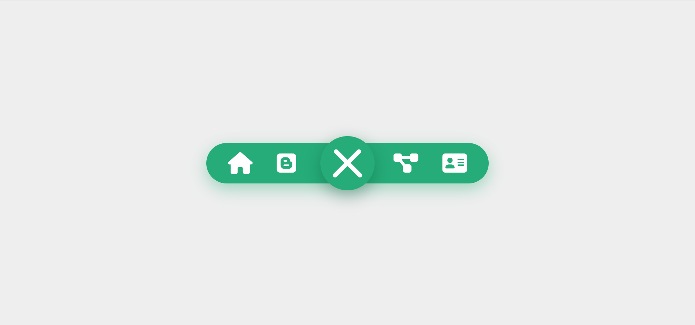

# creative_navigation

## Description
An navigation menu that is created using HTML, CSS, and JavaScript.  3 dots appear on screen.  When the user clicks on the 3 dots the menu expands and the user can see the interactive icons. To close the menu the user clicks on the X on the screen. The icons and menu shrink and the 3 dots return. An image of the expanded menu is below.

## Demo
A demo for the project can be found here: https://tod619.github.io/creative_navigation/

